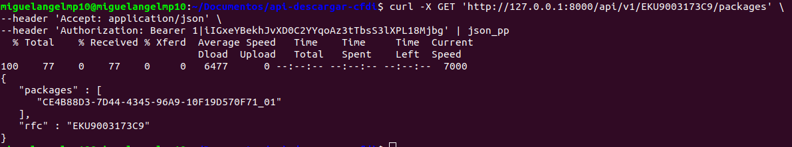
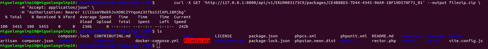

## {rfc}/packages
Reporta los la lista de los paquetes en el almacenamiento local
-   **URL**

    - `GET /api/v1/{rfc}/packages`

-   **URL Params**
     - `rfc=[string]`
-   **Data Params**
    - None
- **Required:**
    -   `rfc=[string]`
-   **Success Response:**

    **Code:** 200

    **Content:**

    ```json
    {
        "rfc": "EKU9003173C9",
        "packages": [
           "CE4B88D3-7D44-4345-96A9-10F19D570F71_01"
        ]
    }
    ```
    
*   **Errors Response:**

    * **Code:** 401 Unauthorized <br />
      **Content:**
    ```bash
        {
            "message": "Unauthenticated."
        }
     ```

-   **Example**
    ```bash
        curl -X GET 'http://localhost:8000/api/v1/EKU9003173C9/packages' \
        -H "Accept: application/json" \
        -H "Authorization: Bearer 1|iIGxeYBekhJvXD0C2YYqoAz3tTbsS3lXPL18Mjbg"
    ```


## GET /{rfc}/packages/{packageId}
Permite obtener un paquete  almacenamiento local dato un packageId
-   **URL**

    - `GET /api/v1/{rfc}/packages/{packageId}`

-   **URL Params**
    - `rfc=[string]`
    - `packageId=[string]`
-   **Data Params**
    - None
- **Required:**
    -   `rfc=[string]`
    -   `packageId=[string]`
-   **Success Response:**

    **Code:** 200

    **Content:**
      - Archivo zip solicitado

*   **Errors Response:**

    * **Code:** 401 Unauthorized <br />
      **Content:**
    ```bash
        {
            "message": "Unauthenticated."
        }
     ```

-   **Example**
    ```bash
        curl -X GET 'http://127.0.0.1:8000/api/v1/EKU9003173C9/packages/CE4B88D3-7D44-4345-96A9-10F19D570F71_01' --output filezip.zip \
        -H "Accept: application/json" \
        -H "Authorization: Bearer 1|iIGxeYBekhJvXD0C2YYqoAz3tTbsS3lXPL18Mjbg"
    ```



## DELETE /{rfc}/packages/{packageId}
