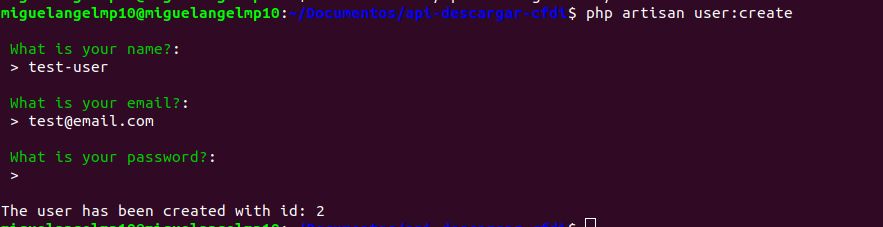
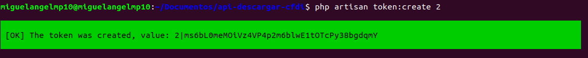

## Comandos artisan para crear usuario y generar Bearer token

### Creación de usuario

_El siguiente comando le preguntará los datos del usuario y como resultado obtendrá un mensaje que contiene el `ID` del usuario._

```bash
    php artisan user:create
```
#### Ejemplo


### Creación de tokens

_El siguiente comando registrará un token para el `userId` pasado como argumento y como resultado obtendrá el token._

```bash
    php artisan token:create {userId}
```
#### Ejemplo

