# Ejemplos de uso vía cli

* [sw:make:query](../docs/ejemplos_cli.md#swmakequery)
* [sw:verify:query](../docs/ejemplos_cli.md#swverifyquery)
* [sw:download:packages](../docs/ejemplos_cli.md#swdownloadpackages)

Otros comando implementados

* [sw:send:cer-key](../docs/ejemplos_cli.md#swsendcer-key)
* [sw:sync:sat:catalogs](../docs/ejemplos_cli.md#swsyncsatcatalogs)
* [sw:metadata:package:reader](../docs/ejemplos_cli.md#swmetadatapackagereader)


## sw:make:query
### Mostrar ayuda del comando
```bash
  php artisan sw:make:query -h
 ```
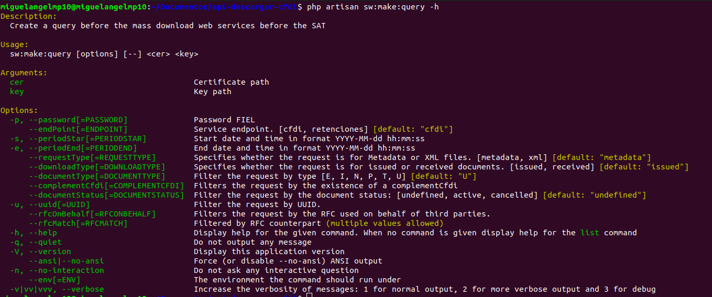

### Este comando permite la creación de una consulta ante el servicio web de descarga masiva del sat.

```bash
  php artisan sw:make:query tests/_files/fake-fiel/EKU9003173C9.cer tests/_files/fake-fiel/EKU9003173C9.key -p 12345678a -s '2019-01-13 00:00:00' -e '2019-01-13 23:59:59' --requestType='metadata' --downloadType='received'
 ```
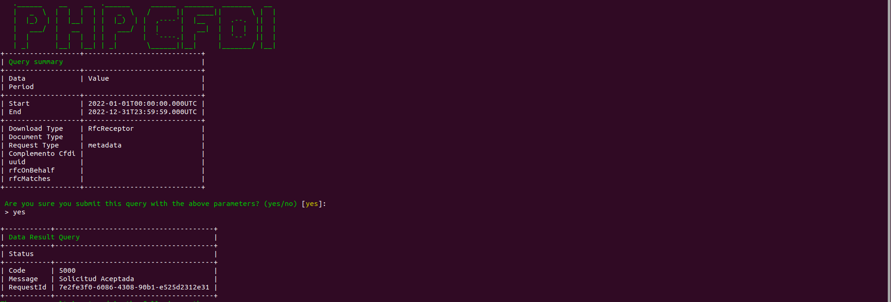

## sw:verify:query
### Mostrar ayuda del comando

```bash
  php artisan sw:verify:query -h
 ```
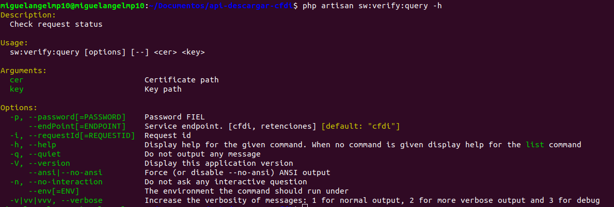

### Este comando permite mostrar el estatus de una consulta usando su "requestId"
```bash
  php artisan sw:verify:query tests/_files/fake-fiel/EKU9003173C9.cer tests/_files/fake-fiel/EKU9003173C9.key -p 12345678a --requestId='7e2fe3f0-6086-4308-90b1-e525d2312e31'
 ```

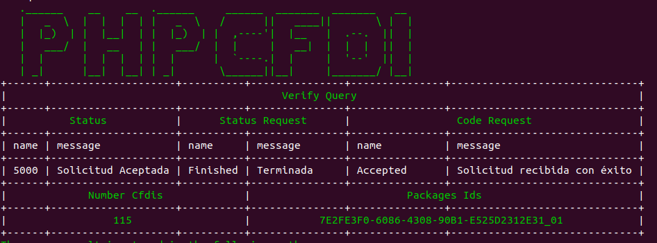

## sw:download:packages
### Mostrar ayuda del comando
```bash
  php artisan sw:download:packages -h
 ```
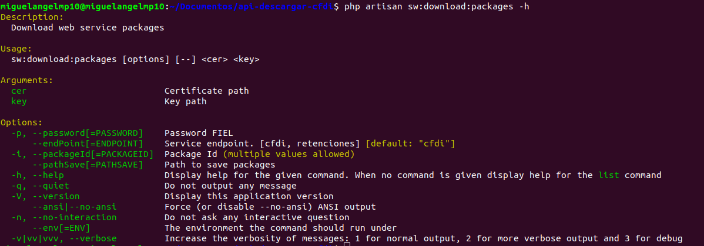

### Comando que permite descargar por lo menos un paquete de cfdis
```bash
  php artisan sw:download:packages  tests/_files/fake-fiel/EKU9003173C9.cer tests/_files/fake-fiel/EKU9003173C9.key -p 12345678a --packageId='7E2FE3F0-6086-4308-90B1-E525D2312E31_01' --pathSave='/home/miguelangelmp10/Descargas/'
 ```
### Resultado
```text
El paquete /home/miguelangelmp10/Descargas/7E2FE3F0-6086-4308-90B1-E525D2312E31_01 se ha almacena
 ```

## sw:send:cer-key
### Comando que permite revisar el estatus de la FIEL
```bash
  php artisan sw:send:cer-key  tests/_files/fake-fiel/EKU9003173C9.cer tests/_files/fake-fiel/EKU9003173C9.key -p 12345678a --copyFiel No
 ```
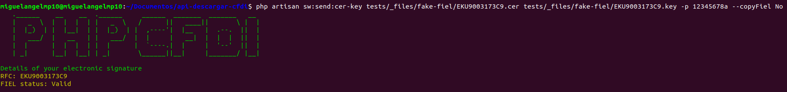

## sw:sync:sat:catalogs
### Este comando permite la sincronización de catalogos usando phpcfdi/resources-sat-catalogs para proceder a generar la base de datos en el proyecto y generar los modelos de Eloquent.

```bash
  php artisan sw:sync:sat:catalogs
```
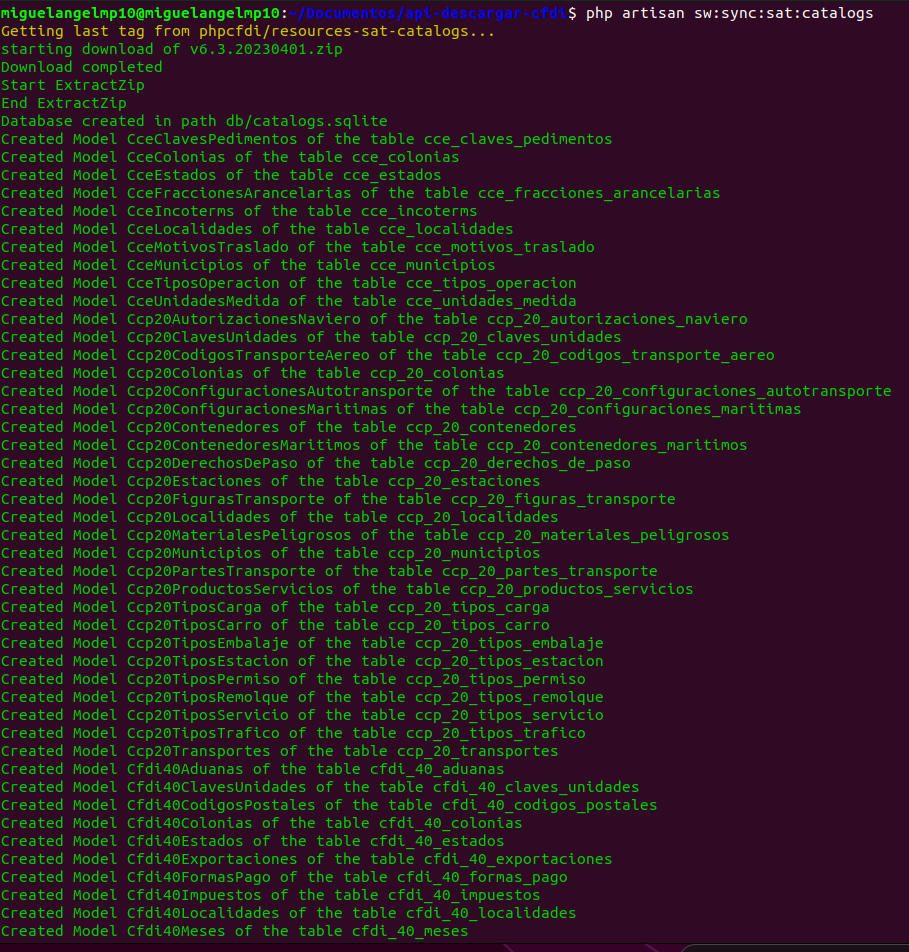
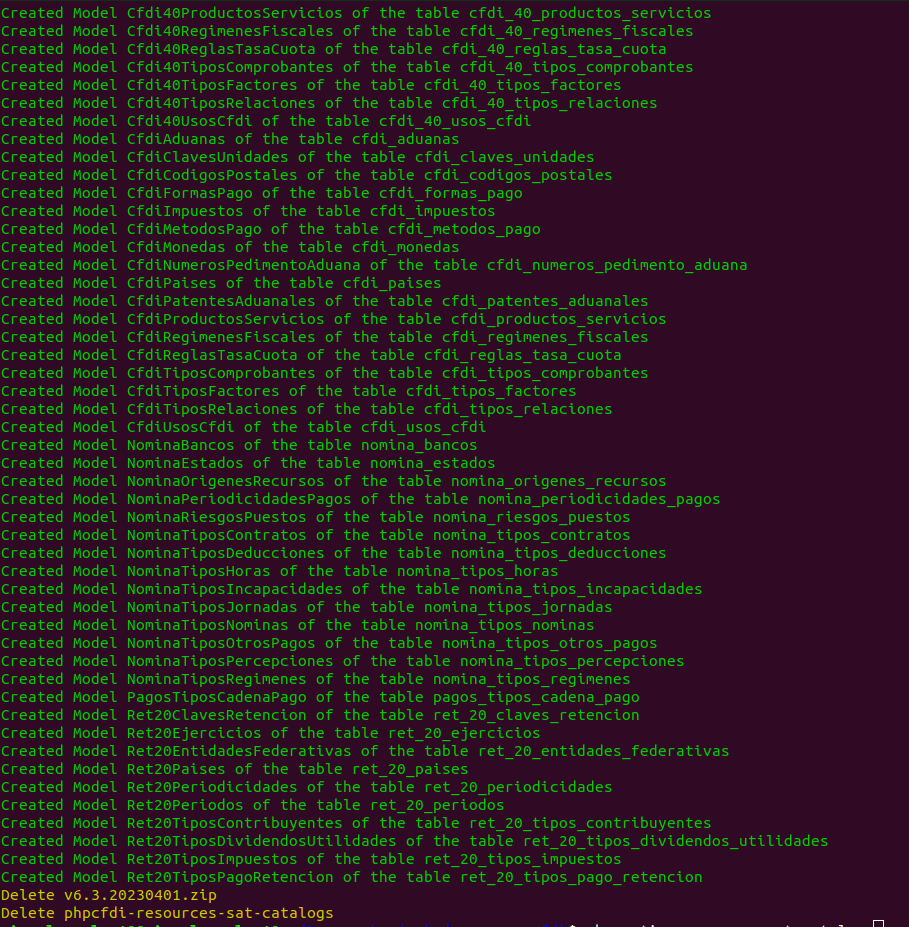

## sw:metadata:package:reader
### Mostrar ayuda del comando
```bash
  php artisan sw:metadata:package:reader -h
```
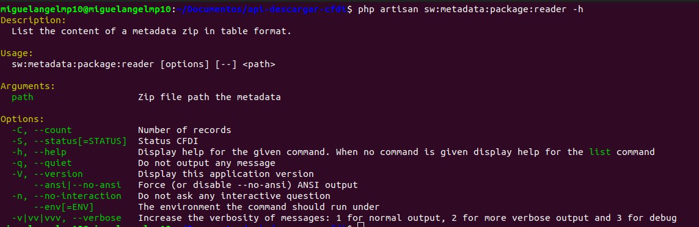

### Lectura de archivo de metadata tradicional 
```bash
  php artisan sw:metadata:package:reader tests/_files/metadata_normal.zip
```
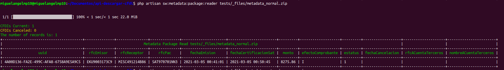
### Lectura de archivo de metadata de retención de pagos

```bash
  php artisan sw:metadata:package:reader tests/_files/metadata_retencion_pagos.zip
```

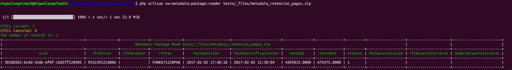


